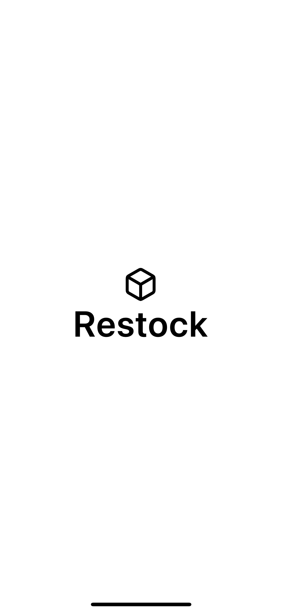
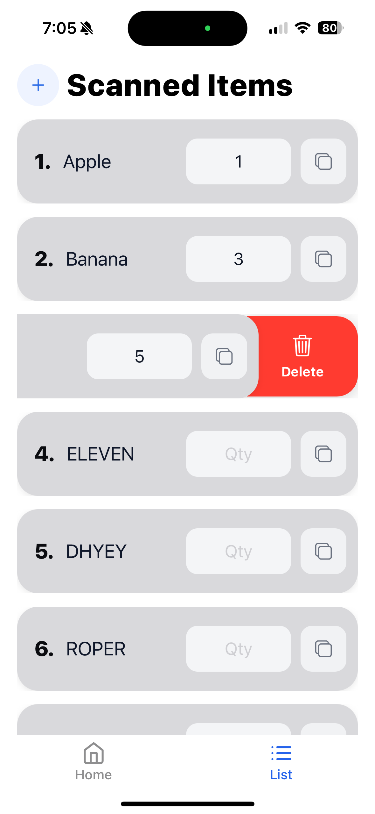

# Restock (WIP)

**1-sentence pitch:**  
Restock is a fast, offline-first inventory scanner that uses OCR to log stock items in under 3 seconds—ideal for small stores and warehouse use.

---
- Demo (silent): https://x.com/SpydeyDev/status/1957669399718162605
---

##  Why Restock?  
- Stores often rely on manual logs—time-consuming and error-prone.  
- Restock accelerates inventory entry using Google Vision OCR, caching entries offline, and syncing when online.

---

##  Tech Stack  
- **Framework:** React Native (Expo + TypeScript)  
- **OCR:** Google Vision TEXT_DETECTION  
- **Storage:** AsyncStorage (offline cache)  
- **CI/CD:** EAS builds → TestFlight

---

##  Current Status  
- WIP: MVP features live, TestFlight build uploaded  
- Goal: Reduce scan-to-log time to **under 3 seconds per item**  
- Demo: *(coming soon — adding screen recording today)*  
- Future: inline scan, manual entry fallback, history list, feedback-driven iteration

---

##  Screenshots  
*(Add images here once recorded)*
  
  



---

##  How To Run  
```bash
git clone https://github.com/aaaryanpatel/restock-clean.git
cd restock-clean
npm install
expo start
